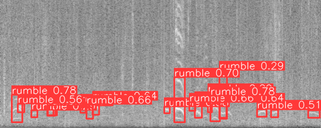
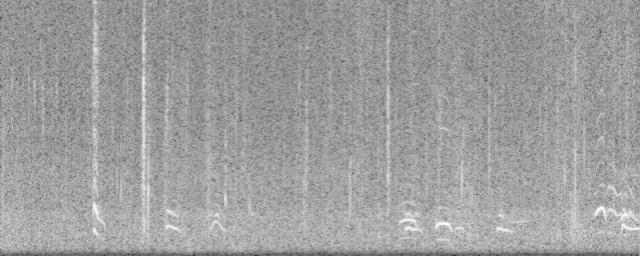

# Forest Elephants Rumble Detection

Contains a collection of software packages for passive acoustic monitoring
(PAM) of forest elephants rumbles.


The low fundamental frequencies of elephant rumbles are located at the bottom
of the spectrogram and typically range from 14-35 Hz. These are the primary
frequencies of the rumbles. Harmonics, which are integer multiples of the
fundamental frequencies, appear as several horizontal lines above the
fundamental frequency. For example, if the fundamental frequency is 20 Hz, the
harmonics will be at 40 Hz, 60 Hz, 80 Hz, and so on. These harmonic lines are
spaced at regular intervals and are usually less intense (lighter) than the
fundamental frequency.

## Introduction

Elephant rumbles are low-frequency vocalizations produced by elephants,
primarily for communication. These rumbles are a fundamental part of elephant
social interactions and serve various purposes within their groups. Here’s a
detailed explanation:

### Characteristics of Elephant Rumbles

1. __Low Frequency__: Elephant rumbles typically fall in the infrasound range,
   below 20 Hz, which is often below the threshold of human hearing. However,
some rumbles can also be heard by humans as a low, throaty sound.

2. __Long Distance Communication__: Due to their low frequency, rumbles can
   travel long distances, sometimes several kilometers, allowing elephants to
communicate with each other across vast areas, even when they are out of sight.
It can also travel through dense forests as the wavelength is very large.

3. __Vocal Production__: Rumbles are produced by the larynx and can vary in
   frequency, duration, and modulation. Elephants use different types of
rumbles to convey different messages.

### Functions of Elephant Rumbles

1. __Coordination and Social Bonding__: Elephants use rumbles to maintain
   contact with members of their herd, coordinate movements, and reinforce
social bonds. For example, a matriarch might use a rumble to lead her group to
a new location.

2. __Reproductive Communication__: Male elephants, or bulls, use rumbles to
   communicate their reproductive status and readiness to mate. Females also
use rumbles to signal their estrus status to potential mates.

3. __Alarm and Distress Calls__: Rumbles can signal alarm or distress, warning
   other elephants of potential danger. These rumbles can mobilize the herd and
prompt protective behavior.

4. __Mother-Calf Communication__: Mothers and calves use rumbles to stay in
   contact, especially when they are separated. Calves may rumble to signal
hunger or distress, prompting a response from their mothers.

### Importance of Understanding Elephant Rumbles

1. __Conservation Efforts__: Understanding elephant communication helps in
   conservation efforts by providing insights into their social structure,
habitat needs, and responses to environmental changes.

2. __Human-Elephant Conflict Mitigation__: By recognizing alarm rumbles,
   conservationists can better manage and mitigate conflicts between humans and
elephants, especially in regions where their habitats overlap.

3. __Enhancing Animal Welfare__: For elephants in captivity, understanding
   their rumbles can help caretakers improve their welfare by addressing their
social and environmental needs more effectively.

Overall, elephant rumbles are a vital aspect of their complex communication
system, reflecting the sophistication of their social interactions and the
importance of acoustic signals in their daily lives.

## Collaboration

This work is a collaboration with [The Elephant Listening
Project](https://www.elephantlisteningproject.org/) and [The Cornell
Lab](https://www.birds.cornell.edu/home/).

> To conserve the tropical forests of Africa through acoustic monitoring, sound
> science, and education, focusing on forest elephants
>
> - The Elephant Listening Project

Fifty microphones are arranged in a grid within the Tropical Forest of Gabon,
continuously recording forest sounds around the clock. The provided software is
an advanced sound analyzer capable of processing these extensive audio
recordings at high speed, allowing for the analysis of terabytes of audio data
in just a few days.

## Run

### Python Code

Once one has followed the setup section below, it is possible to test the
rumble detector using the following command:

```sh
python ./scripts/model/yolov8/predict_raven.py \
   --input-dir-audio-filepaths ./data/08_artifacts/audio/rumbles/ \
   --output-dir ./data/05_model_output/yolov8/predict/ \
   --model-weights-filepath ./data/08_artifacts/model/rumbles/yolov8/weights/best.pt \
   --verbose \
   --loglevel "info"
```

### Docker Image for Rumble Detector

The Rumble Detector is also available as a Docker image, ensuring portability
across different operating systems and setups as long as Docker is installed.

#### Pull the Docker Image

To pull the Docker image, use the following command:

```sh
docker pull earthtoolsmaker/elephantrumbles-detector:latest
```

#### Run the Docker Container

To run the Docker container, execute:

```sh
docker run --rm earthtoolsmaker/elephantrumbles-detector:latest
```

Note: By default, audio files and predictions are contained within the
container, which limits its practical use. However, this command demonstrates
the detector's functionality.

#### Using Custom Audio Files and Saving Results

To analyze your own audio files and save the results to your machine, you need
to mount two directories into the Docker container:

- __input-dir-audio_filepaths__: The directory containing the audio files to be analyzed.
- __output-dir__: The directory where the artifacts and predictions will be saved.

In the example below, the `input-dir-audio_filepaths` is
`./data/03_model_input/sounds/rumbles/` and the `output-dir` is
`./runs/predict/`. The program will analyze the audio files in the input
directory and save the results in the output directory.

```sh
docker run --rm \
  -v ./data/03_model_input/sounds/rumbles/:/app/data/08_artifacts/audio/rumbles/ \
  -v ./runs/predict/:/app/data/05_model_output/yolov8/predict \
  earthtoolsmaker/elephantrumbles-detector:latest
```

### Docker

The rumble detector is also packaged as a Docker image, which makes it portable on different operating systems and setups as long as Docker is installed.

Run the following command to pull the docker image:

```sh
docker pull earthtoolsmaker/elephantrumbles-detector:latest
```

Run the following command to run the docker container:

```sh
docker run --rm earthtoolsmaker/elephantrumbles-detector:latest
```

The audio files and predictions are locked inside the container, so it is not really useful. But it should already show that it is able to detect rumbles.

To load your own audio files and save the results in your machine, one needs to mount two directories into the docker container as follows:

- __input-dir-audio_filepaths__: This is the folder that contains the audio files to be analyzed
- __output-dir__: This is where the artifacts and predictions will be saved on your machine

In the example below, the __input-dir-audio_filepaths__ is `./data/03_model_input/sounds/rumbles/` and the __output-dir__ is `./runs/predict/`. The program analyzes audio files present in the input-dir-audio-filepaths and persists results in output-dir.

```sh
docker run --rm \
  -v ./data/03_model_input/sounds/rumbles/:/app/data/08_artifacts/audio/rumbles/ \
  -v ./runs/predict/:/app/data/05_model_output/yolov8/predict \
  earthtoolsmaker/elephantrumbles-detector:latest
```

### Pipeline overview and outputs

The pipeline will do the following:

1. Generate spectrograms in the frequency range 0-250Hz, where all the elephant
   rumbles are located
2. Run the rumble object detector on batches of spectrograms
3. Save the predictions as a CSV

__Note__: The verbose flag tells the command to also persist the generated
spectrograms and predictions, they will be located in the `output-dir`.

| Spectrogram | Prediction |
|:-----------:|:----------:|
|  |  |
|  |  |
|  |  |

Below is a sample of a generated CSV file:

| probability | freq_start | freq_end | t_start | t_end | audio_filepath | instance_class |
|:-----------:|:----------:|:--------:|:-------:|:-----:|:--------------:|:--------------:|
| 0.7848126888275146 | 185.34618616104126 | 238.925039768219 | 6.117525324225426 | 11.526521265506744 | data/08_artifacts/audio/rumbles/sample_0.wav | rumble |
| 0.7789380550384521 | 187.46885657310486 | 237.14002966880798 | 107.4117157459259 | 112.39507365226746 | data/08_artifacts/audio/rumbles/sample_0.wav | rumble |
| 0.6963282823562622 | 150.82329511642456 | 238.47350478172302 | 89.08285737037659 | 94.3071436882019 | data/08_artifacts/audio/rumbles/sample_0.wav | rumble |
| 0.6579649448394775 | 203.18885147571564 | 231.6151112318039 | 44.13426876068115 | 47.50721764564514 | data/08_artifacts/audio/rumbles/sample_0.wav | rumble |
| ... | ... | ... | ... | ... | ... | ... |

## Benchmark

The aim of this project is to enable the rapid analysis of large-scale audio
datasets, potentially reaching terabyte scales. By leveraging multiprocessing
and utilizing the maximum number of CPU and GPU cores, we strive to optimize
processing speed and efficiency. Benchmark analyses have been conducted on both
CPU and GPU to ensure optimal performance.

### CPU

Processing a 24-hour audio file on an 8-core CPU takes approximately 35 seconds
in total:

- __Loading the audio file__: ~4 seconds
- __Generating spectrograms__: ~11 seconds
- __Running model inference__: ~19 seconds
- __Miscellaneous tasks__: ~1 second

### GPU + CPU

Processing a 24-hour audio file using a GPU (T4) and an 8-core CPU takes
approximately 20 seconds in total:

- __Loading the audio file__: ~4 seconds
- __Generating spectrograms__: ~11 seconds
- __Running model inference__: ~4 seconds
- __Miscellaneous tasks__: ~1 second

### Back of the envelope calculation

- Number of sound recorders: $`N_{sr} = 50`$
- Number of days to analyze: $`N_{d} = 30`$  (1 month)
- Size of a 24hour audio recording $`W = 657`$ MB
- Amount of data to analyze: $`N_{sr} \times N_{d} \times W = 986`$ GB (1 month)
- Time to process a 24h audio file with a CPU: $`T_{CPU} = 35`$s
- Time to process a 24h audio file with a GPU: $`T_{GPU} = 20`$s

#### With CPU

On a CPU setup with 8 cores, analyzing 1 month of sound data - ~1TB - would
require:
$`N_{sr} \times N_{d} \times T_{CPU} = 50 \times 30 \times 35 = 14.6`$ hours

To analyze 6 months of sound data - ~6TB - it would require:
$`N_{sr} \times N_{d} \times T_{CPU} = 50 \times 180 \times 35 = 3.6`$ days

#### With CPU + GPU

On a CPU setup with 8 cores, analyzing 1 month of sound data would require:
$`N_{sr} \times N_{d} \times T_{GPU} = 50 \times 30 \times 20 = 8.3`$ hours

To analyze 6 months of sound data - ~6TB - it would require:
$`N_{sr} \times N_{d} \times T_{GPU} = 50 \times 180 \times 20 = 2.1`$ days

## Setup

### Dependencies

- [Poetry](https://python-poetry.org/): Python packaging and dependency
management - Install it with something like `pipx`
- [Git LFS](https://git-lfs.com/): Git Large File Storage replaces large
files such as jupyter notebooks with text pointers inside Git while
storing the file contents on a remote server like github.com
- [DVC](https://dvc.org/): Data Version Control  - This will get
installed automatically
- [MLFlow](https://mlflow.org/): ML Experiment Tracking - This will get
installed automatically

### Install

#### Poetry

Follow the [official documentation](https://python-poetry.org/docs/) to install `poetry`.

#### Git LFS

Make sure [`git-lfs`](https://git-lfs.com/) is installed on your system.

Run the following command to check:

```sh
git lfs install
```

If not installed, one can install it with the following:

##### Linux

```sh
sudo apt install git-lfs
git-lfs install
```

##### Mac

```sh
brew install git-lfs
git-lfs install
```

##### Windows

Download and run the latest [windows installer](https://github.com/git-lfs/git-lfs/releases).

#### Project Dependencies

Create a virtualenv and install python version with conda - or use a
combination of pyenv and venv:

```sh
conda create -n pyronear-mlops python=3.12
```

Activate the virtual environment:

```sh
conda activate pyronear-mlops
```

Install python dependencies

```sh
poetry install
```

## Project structure and conventions

The project is organized following mostly the [cookie-cutter-datascience
guideline](https://drivendata.github.io/cookiecutter-data-science/#directory-structure).

### Data

All the data lives in the `data` folder and follows some [data engineering
conventions](https://docs.kedro.org/en/stable/faq/faq.html#what-is-data-engineering-convention).

### Library Code

The library code is available under the `src/forest_elephants_rumble_detection` folder.

### Notebooks

The notebooks live in the `notebooks` folder. They are automatically synced to
the Git LFS storage.
Please follow [this
convention](https://drivendata.github.io/cookiecutter-data-science/#notebooks-are-for-exploration-and-communication)
to name your Notebooks.

`<step>-<ghuser>-<description>.ipynb` - e.g., `0.3-mateo-visualize-distributions.ipynb`.

### Scripts

The scripts live in the `scripts` folder, they are
commonly CLI interfaces to the library
code.

## DVC

DVC is used to track and define data pipelines and make them
reproducible. See `dvc.yaml`.

To get an overview of the pipeline DAG:

```sh
dvc dag
```

To run the full pipeline:

```sh
dvc repro
```

## MLFlow

An MLFlow server is running when running ML experiments to track
hyperparameters and performances and to streamline model
selection.

To start the mlflow UI server, run the following command:

```sh
make mlflow_start
```

To stop the mlflow UI server, run the following command:

```sh
make mlflow_stop
```

To browse the different runs, open your browser and navigate to the URL:
[http://localhost:5000](http://localhost:5000)
